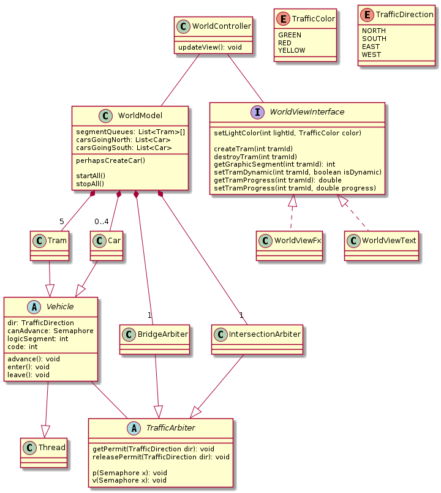

# Tramway
Concurrent Programming assignment



## Coding Style
Follow [Google's Java style guide](https://google.github.io/styleguide/javaguide.html)

Document your code: [How to Write Doc Comments for the Javadoc Tool](https://www.oracle.com/technetwork/articles/java/index-137868.html)


## JavaFX Animation
- To actually animate `Car`s and `Tram`s: [PathTransition](https://docs.oracle.com/javase/8/javafx/api/javafx/animation/PathTransition.html).

- To `play`, `pause`, and manually progress (`jumpTo` or `playFrom`) animations: [Timeline](https://docs.oracle.com/javase/8/javafx/api/javafx/animation/Timeline.html).

- To update relative/paused trams: [AnimationTimer](https://docs.oracle.com/javase/8/javafx/api/javafx/animation/AnimationTimer.html).

- MAYBE to be notified of Trams' animation progress: [KeyFrame](https://docs.oracle.com/javase/8/javafx/api/javafx/animation/KeyFrame.html) or maybe [ObservableList](https://docs.oracle.com/javase/8/javafx/api/javafx/collections/ObservableList.html).


## Problems

### Bridge crossing
Trams go from section 1 to 2 (Tram12) or from section 2 to 1 (Tram21)

**NOTE: "Changement" may happen when a Tram calls enter() or leave()**

```
int turn = 12
int count12 = 0, count21 = 0
Semaphore sem12 = 0, sem21 = 0
Semaphore mutex = 1
```

```
Tram12::enter() {
  p(mutex)
  count12++
  if ( (turn == 12 && count12 == 1) || (turn == 21 && count21 == 0) ) {
    turn = 12
    v(sem12)
  }
  v(mutex)

  p(sem12)
}

Tram12::leave() {
  p(mutex)
  count12--
  if (count12 > 0) {
    v(sem12)
  } else {
    if (count21 > 0) {
      turn = 21
      v(sem21)
    }
  }
  v(mutex)
}
```

```
Tram21::enter() {
  p(mutex)
  count21++
  if ( (turn == 21 && count21 == 1) || (turn == 12 && count12 == 0) ) {
    turn = 21
    v(sem21)
  }
  v(mutex)

  p(sem21)
}

Tram21::leave() {
  p(mutex)
  count21--
  if (count21 > 0) {
    v(sem21)
  } else {
    if (count12 > 0) {
      turn = 12
      v(sem12)
    }
  }
  v(mutex)
}
```

### Traffic intersection

**NOTE: "Changement" may happen when a Tram calls enter() or leave(), not timeout-based!**

```
int passingTrams = 0
Semaphore voie1 = 1, feu1 = 1, voie2 = 1, feu2 = 1
```

```
Car1::enter() {
  p(voie1)
  p(feu1)
}

Car1::leave() {
  p(feu1)
  p(voie1)
}
```

```
Car2::enter() {
  p(voie2)
  p(feu2)
}

Car2::leave() {
  p(feu2)
  p(voie2)
}
```

```
Tram::enter() {
  p(mutex)
  passingTrams++
  if (passingTrams == 1) {
    v(mutex)
    p(feu1)
    p(feu2)
  } else {
    v(mutex)
  }
}

Tram::leave() {
  p(mutex)
  passingTrams--
  if (passingTrams == 0) {
    v(mutex)
    v(feu1)
    v(feu2)
  } else {
    v(mutex)
  }
}
```
