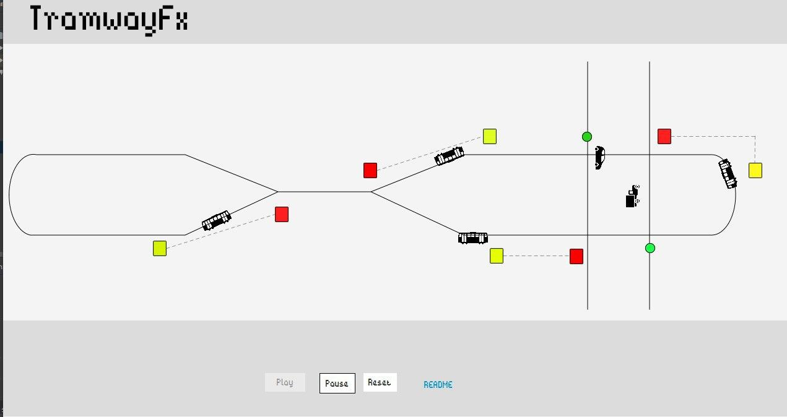

# TramwayFX
Concurrent Programming assignment.

Process-based simulation in Java/JavaFX à la MVC (more like [MVP](https://stackoverflow.com/a/1317742) actually)

## Screenshots

### ASCII


### JavaFX


---

## Table of Contents

- [Problem](#problem)

- [Approach](#approach)

- [Algorithms](#algorithms)
  - [Bridge crossing](#bridge-crossing)
  - [Traffic intersection](#traffic-intersection)

- [Implementation](#implementation)
  - [Classes](#classes)
  - [JavaFX Animation](#javafx-animation)

- [Notes](#notes)

## Problem
A traffic-control system to manage traffic lights of trams and cars...

## Approach
As can be seen in the screenshot below, a tram (starting from the bottom left side) pass by some "obstacles":
- The bridge
- the intersection
- the intersection again
- and finally, the bridge again

Passing by each of these "obstacles" requires executing a different algorithm. The tram needs to keep record of its current section to know what algorithm to execute.

`TrafficArbiter` classes (BridgeArbiter and IntersectionArbiter) are used to store shared state data and execute synchronization algorithms on behalf of vehicles (`Tram`s and `Car`s)

---

The path the tram takes can be split into four segments:
0. A-B: Starting point to bridge: Asks BridgeArbiter for permission to go **EAST**.
1. B-C: Bridge to intersection: Tells IntersectionArbiter to stop cars and give only trams permission to cross.
2. C-D: Intersection to intersection: : Tells IntersectionArbiter to stop cars and give only trams permission to cross.
3. D-E: Intersection to bridge: Asks BridgeArbiter for permission to go **WEST**.

If it's in segment 0 it asks the bridge arbiter for permission to go east,
```
                                     [9:R]..[8:Y] (7:G)....[6:R]...  
                                                       |  |       .  
                                                       |  |       .  
   +----------------+                +-----------------+--+D-+    .  
  /                  \              /                  |  |   \ [5:Y]
 /                    \            E                   |  |   |      
 |                     ^^^^^^^^^^^^                    |  |   |      
 \                    B            \                   |  |   |      
  \                  /              \                  |  |   /      
   +A---------------+                +----------------C+--+--+       
                                                       |  |          
                                                       |  |          
         [0:G]...[1:G]                [2:Y].......[3:R]....(4:G)     
```

## Algorithms

### Bridge crossing

**NOTE: Changement \*may\* happen when a Tram calls enter() or leave()**

```
turn = WEST

int goingWest = 0, goingEast = 0
Semaphore canGoWest = 0, canGoEast = 0
Semaphore mutex = 1
```

```
TramGoingWest::enter() {
  p(mutex);
  goingWest++;
  if ( (turn == WEST && goingWest == 1) || (turn == EAST && goingEast == 0) ) {
    turn = WEST;
    v(canGoWest);
  }
  v(mutex);

  p(canGoWest);
}

TramGoingWest::leave() {
  p(mutex);
  goingWest--;
  if (goingWest > 0) {
    v(canGoWest);
  } else {
    if (goingEast > 0) {
      turn = EAST;
      v(canGoEast);
    }
  }
  v(mutex);
}
```

```
TramGoingEast::enter() {
  p(mutex);
  goingEast++;
  if ( (turn == EAST && goingEast == 1) || (turn == WEST && goingWest == 0) ) {
    turn = EAST;
    v(canGoEast);
  }
  v(mutex);

  p(canGoEast);
}

TramGoingEast::leave() {
  p(mutex);
  goingEast--;
  if (goingEast > 0) {
    v(canGoEast);
  } else {
    if (goingWest > 0) {
      turn = WEST;
      v(canGoWest);
    }
  }
  v(mutex);
}
```

### Traffic intersection

**NOTE: "Changement" may happen when a Tram calls enter() or leave(), not timeout-based!**

```
int passingTrams = 0

Semaphore canGoNorth = 1, lightNorthSem = 1
Semaphore canGoSouth = 1, lightSouthSem = 1
Semaphore mutex = 1
```

```
CarGoingNorth::enter() {
  p(canGoNorth);
  p(lightNorthSem);
}

CarGoingNorth::leave() {
  v(lightNorthSem);
  v(canGoNorth);
}
```

```
CarGoingSouth::enter() {
  p(canGoSouth);
  p(lightSouthSem);
}

CarGoingSouth::leave() {
  v(lightSouthSem);
  v(canGoSouth);
}
```

```
Tram::enter() {
  p(mutex);
  passingTrams++;
  if (passingTrams == 1) {
    v(mutex);
    p(lightNorthSem);
    p(lightSouthSem);
  } else {
    v(mutex);
  }
}

Tram::leave() {
  p(mutex);
  passingTrams--;
  if (passingTrams == 0) {
    v(mutex);
    v(lightNorthSem);
    v(lightSouthSem);
  } else {
    v(mutex);
  }
}
```

## Implementation

### Classes


- Each Tram and Car is has a thread.

- WorldModel is responsible for creating the initial trams, and starting a timer that generates cars (heading north or south) randomly.

- WorldController interpretes the WorldModel and updates the WorldView. This happens either at the request of the ModelView (in case of JavaFX, see below) or automatically every few millis.


_See the JavaDoc comments for a description of individual classes and methods._

### JavaFX Animation
- To actually animate `Tram`s and `Car`s on their paths, and to `play`, `pause`, and manually progress (`jumpTo`) animations: [PathTransition](https://docs.oracle.com/javase/8/javafx/api/javafx/animation/PathTransition.html).

- To update relative/paused trams: [AnimationTimer](https://docs.oracle.com/javase/8/javafx/api/javafx/animation/AnimationTimer.html).

### Notes
- Tried to follow [Google's Java style guide](https://google.github.io/styleguide/javaguide.html)

- Used `Collections.syncronizedList(..)` with [ArrayList](https://docs.oracle.com/javase/8/docs/api/java/util/ArrayList.html) to ensure thread-safety when manipulating vehicle queues in WorldModel.

- We call `worldController.updateView()` from the JavaFX's AnimationTimer because otherwise the WorldController cannot make changes to the WorldView: JavaFX's threads and objects can only be manipulated by/from another JavaFX thread.


## License
Wanis Ramdani & Abdeldjalil Hebal, under CC BY 3.0
